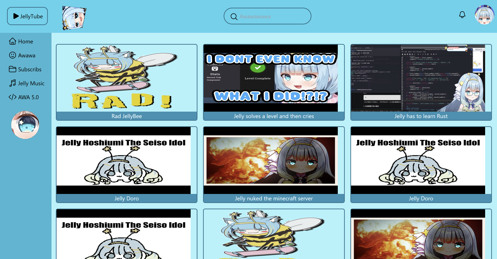

# First time trying Tailwind-CSS

From an assignment where we needed to learn how to use a css framework in 1 day, and create a website that looks similair to populair steaming services like youtube or twitch.
I also made it with a focus on Phase-Connect's Jelly Hoshiumi, My favourite Vtuber. Because I felt like it, and didnt know we needed to upload this on our github...
anyways, I'm pretty proud of it

---

## How to run

- download the files
- double click on the ```index.html``` file, the website should open in your default browser


## Sample of the website

